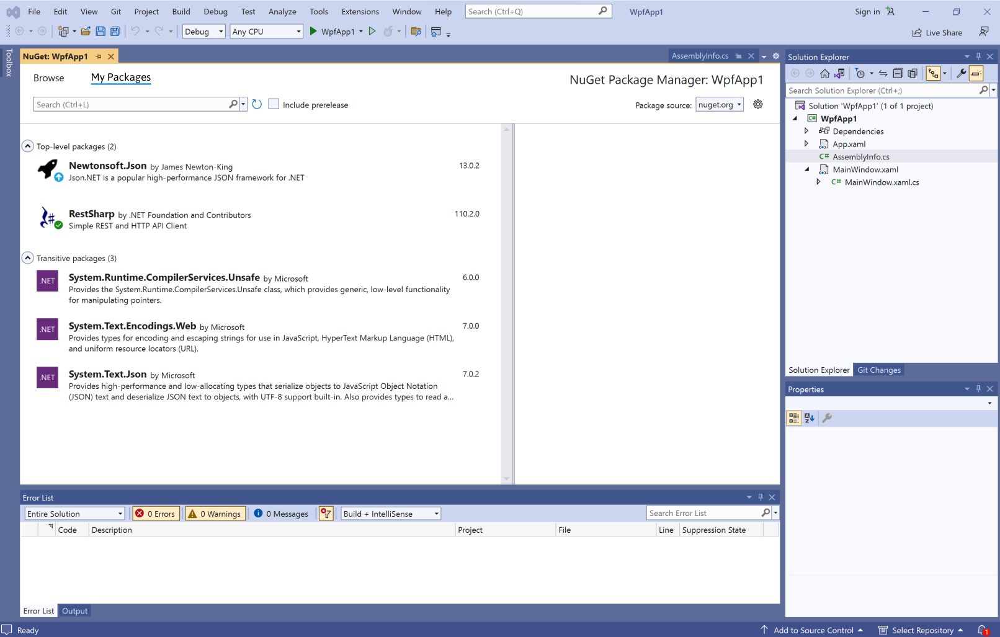
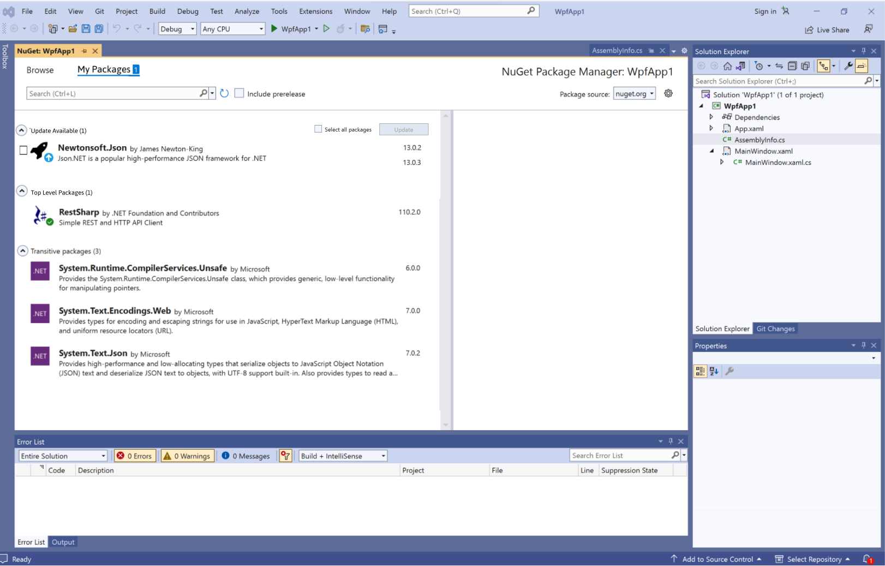

# NuGet PMUI Tab Consolidation

- Allie Barry @albarry4
- Start Date (YYYY-MM-DD)
- GitHub Issue (GitHub Issue link)
- GitHub PR (GitHub PR link)

## Summary

This proposal suggests a solution to reduce the 3 tab format of the NuGet PMUI in Visual Studio as a first step to simplify and modernize the UI, and to address recent customer feedback.  

## Motivation 

We have recently recieved feedback from custmers that the NuGet PMUI design is "clunky" and "requires too much clicking over all the tabs, checkboxes... takes too much clicking and surfing to navigate to varius changelogs". Based on this feedback, I wanted to propose an initial solution to specifcially target and reduce the amount of clicking, and to simplify and consolidate the controls within the PMUI by reducting the number of tabs available. Specifically, this proposal aims to consolidate the "Installed" and "Updates" tabs into a single window titled "My Packages".

## Explanation

### Functional explanation

Put simply, the end goal of this proposal is to reduce the number of tabs in the NuGet PMUI, and to simplify the format of the User interface. 

In this new experience, instead of seeing three tabs ("Browse", "Installed", "Update"), the user will see two tabs at the top of the screen, "Browse", and "My Packages". Below, I will describe how these two tabs will behave. 

The "Browse" tab will remain unchanged from the current design. 

Within the "My Packages" tab, the user will see a list of the packages that they have installed in the current project. The layout of the tab will remain mostly unchanged from the general layout of the seperate "Installed" and "Updates" Tabs that we see today, but with a few tweaks to consolidate all of this information into one tab. 

If no installed backages have an update available, this is what the user will see:

If the user has a package installed with an update available, this is what the user will see: 

### Technical explanation

All packages with an update available will have a checkbox next to it, with the option at the top of the screen to select all, and bulk update all packages with an available update, or handle them on a one-at-a-time basis. This behaves similarly to the current functionality of the "Updates" tab

## Drawbacks

The current layout with the three tabs provides an inutitive design with a clear, seperate function for each of the tabs (browse packages, view the packages I have installed, update packages). 

## Rationale and alternatives

<!-- Why is this the best design compared to other designs? -->
<!-- What other designs have been considered and why weren't they chosen? -->
<!-- What is the impact of not doing this? -->

## Prior Art

<!-- What prior art, both good and bad are related to this proposal? -->
<!-- Do other features exist in other ecosystems and what experience have their community had? -->
<!-- What lessons from other communities can we learn from? -->
<!-- Are there any resources that are relevant to this proposal? -->

## Unresolved Questions

<!-- What parts of the proposal do you expect to resolve before this gets accepted? -->
<!-- What parts of the proposal need to be resolved before the proposal is stabilized? -->
<!-- What related issues would you consider out of scope for this proposal but can be addressed in the future? -->

## Future Possibilities

<!-- What future possibilities can you think of that this proposal would help with? -->
